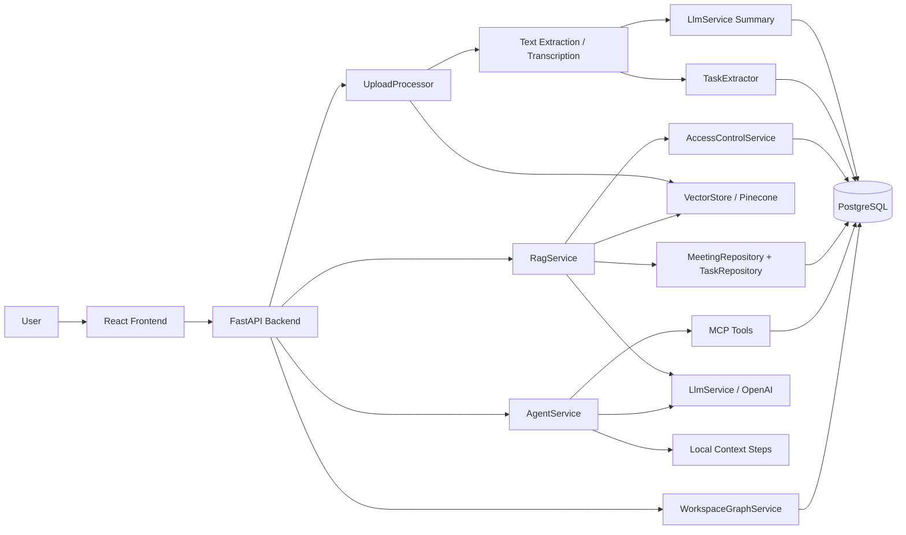
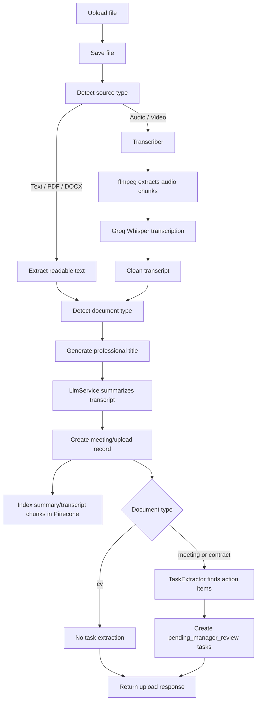
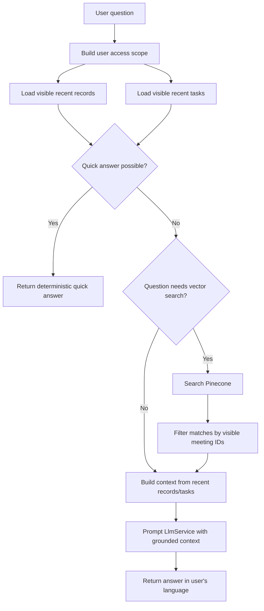
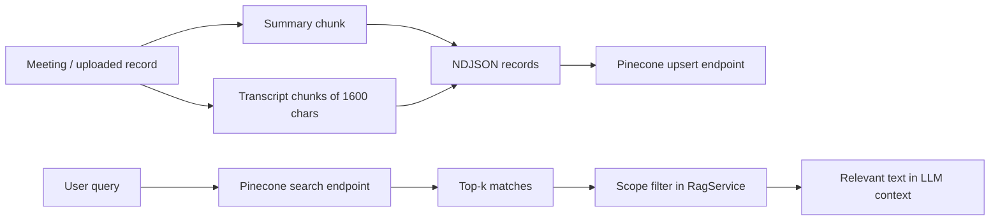
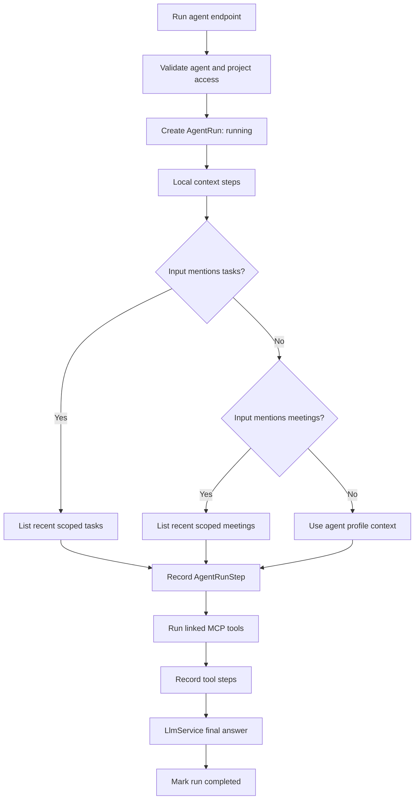
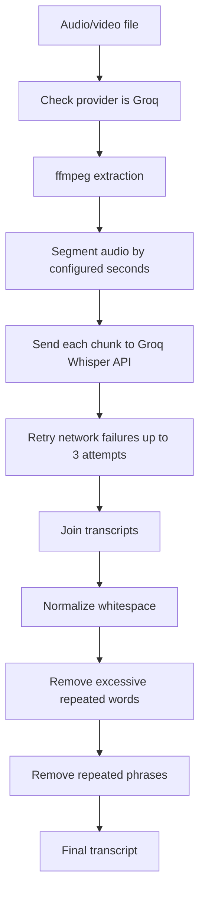
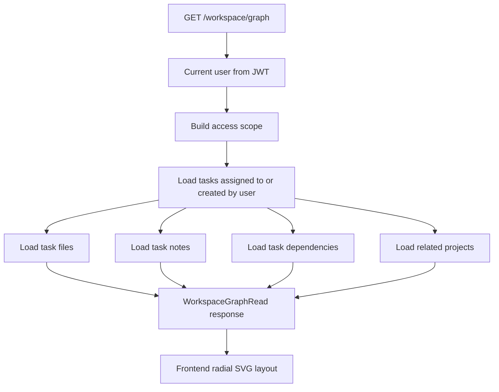

# Teamoria AI Algorithms and Tools Diagrams

This document maps the AI-related code paths in the project: upload processing, transcription, summarization, task extraction, RAG chat, vector search, agents, MCP tools, and workspace graph generation.

## AI Tooling Map

| Area | Main Files | Tools / Libraries | Algorithm Used |
|---|---|---|---|
| LLM completion and summaries | `backend/app/services/llm_service.py` | OpenAI Chat Completions, configured by `OPENAI_MODEL` | Prompt-based generation with low temperature |
| Embeddings | `backend/app/services/embedding_service.py` | OpenAI Embeddings, configured by `OPENAI_EMBEDDING_MODEL` | Text-to-vector embedding |
| Vector indexing and search | `backend/app/services/vector_store.py` | Pinecone REST API, `httpx` | Chunk documents, upsert records, top-k vector search |
| RAG chat | `backend/app/services/rag_service.py` | OpenAI, Pinecone, SQL repositories | Scoped retrieval, quick-answer rules, optional vector search, grounded LLM answer |
| Audio/video transcription | `backend/app/services/transcriber.py` | `ffmpeg`, Groq Whisper API, `httpx` | Audio extraction, chunking, retry, transcript cleaning |
| Upload understanding | `backend/app/services/upload_processor.py` | `pypdf`, `python-docx`, optional `pdf2image` + `pytesseract`, Groq, OpenAI, Pinecone | Source detection, text extraction, document classification, summarization, indexing |
| Task extraction | `backend/app/services/task_extractor.py` | Internal Python rules | Marker/keyword-based action item extraction |
| Agent orchestration | `backend/app/services/agent_service.py` | OpenAI, MCP/local database tools | Context routing, tool execution, step logging, final LLM synthesis |
| MCP tools | `backend/app/services/mcp_service.py` | MCP JSON-RPC over HTTP, local database tools | Tool discovery, schema storage, scoped tool execution |
| Workspace graph | `backend/app/services/workspace_graph_service.py`, `frontend/src/pages/WorkspaceGraph.jsx` | SQLAlchemy, React SVG | Scoped graph construction and radial frontend layout |

## High-Level AI Architecture



ASCII version:

```text
User
  -> React Frontend
  -> FastAPI Backend
      -> UploadProcessor -> text/transcription -> LLM summary -> PostgreSQL
                                      |          -> TaskExtractor -> PostgreSQL
                                      |          -> VectorStore/Pinecone
      -> RagService      -> scoped DB retrieval + optional vector search -> LLM answer
      -> AgentService    -> local context + MCP tools -> LLM final answer
      -> WorkspaceGraph  -> scoped task/file/note/dependency graph
```

## Upload Processing Algorithm



Key algorithms:

- Source detection: content type + file suffix.
- PDF extraction: `pypdf`, fallback OCR with `pdf2image` and `pytesseract` when available.
- DOCX extraction: `python-docx`.
- Audio/video: `ffmpeg` converts media to mono 16 kHz MP3 chunks, then Groq transcribes each chunk.
- Document classification: keyword markers for `cv`, `contract`, or `meeting`.
- Summary: OpenAI chat completion through `LlmService`.
- Task extraction: rule-based keyword scan for markers such as `todo`, `task`, `action item`, `follow up`.

## RAG Chat Algorithm



RAG behavior:

- It never sends the whole database to the LLM.
- It first tries deterministic quick answers for common questions.
- It only calls vector search for deeper questions like search, details, explain, why, or how.
- It filters Pinecone results again using the user's visible meeting IDs.
- The final LLM prompt tells the model to use only provided workspace context.

## Vector Search Algorithm



Important detail: `EmbeddingService` can call OpenAI embeddings, but the current `VectorStore` uses Pinecone's records API with a configured text field. So the active vector workflow is Pinecone text-field indexing/search, not manual local embedding storage.

## Agent Workflow



Agent tools currently supported by local database MCP:

| Tool | Purpose |
|---|---|
| `list_tasks` | List visible tasks, optionally by project or status |
| `search_meetings` | Search visible meetings by title, summary, or transcript |
| `get_project_status` | Return project status and task counts grouped by status |
| `echo` | Return input arguments, mainly useful for testing |

## Transcription Algorithm



Configuration:

| Setting | Default |
|---|---|
| `TRANSCRIPTION_PROVIDER` | `groq` |
| `GROQ_TRANSCRIPTION_MODEL` | `whisper-large-v3-turbo` |
| `GROQ_MAX_AUDIO_MB` | `24` |
| `GROQ_AUDIO_CHUNK_SECONDS` | `300` |
| `TRANSCRIPTION_LANGUAGE` | `auto` |

## Workspace Graph Algorithm



Frontend layout idea:

```text
                 File / Note / Dependency
                         |
      Task ---- Task ---- Employee ---- Task ---- Task
                         |
                 File / Note / Dependency
```

## Where Each AI Feature Starts

| Feature | API Entry Point | Service Entry Point |
|---|---|---|
| Upload file and extract knowledge | `POST /api/v1/meetings/upload` | `UploadProcessor.process()` |
| Ask workspace chat | `POST /api/v1/chat/` | `RagService.answer()` |
| Run an agent | `POST /api/v1/agents/{agent_id}/runs` | `AgentService.run()` |
| Discover/call MCP tools | MCP/admin endpoints | `McpService.discover_tools()` / `McpService.call_tool()` |
| Show employee graph | `GET /api/v1/workspace/graph` | `WorkspaceGraphService.get_for_employee()` |

## Current AI Limitations

- `TaskExtractor` is rule-based, not an LLM extractor.
- `VectorStore` silently skips indexing/search if Pinecone is not configured.
- `LlmService` returns placeholder text when `OPENAI_API_KEY` is missing.
- Arabic strings in some backend files appear mojibake-encoded and should be cleaned.
- Agent local context routing is keyword-based and currently checks for task/meeting words only.
