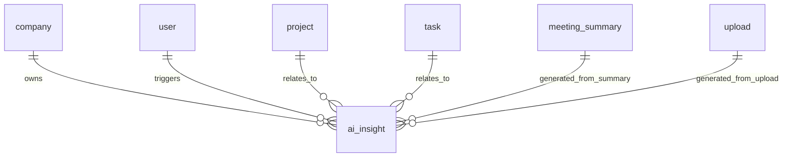

# AI Insights Data Model

## Objective

Define the proposed storage model for AI-generated insights without duplicating existing Teamoria tables. The ERD stores the main AI-related records in `company`, `project`, `task`, `meeting_summary`, `extracted_decision`, `upload`, and `knowledge_chunk`. AI findings should link back to those existing records instead of inventing alternate table names.

## Current Codebase Mapping

| Business concept | Current table/model |
| --- | --- |
| Company / tenant | `company` |
| User | `user` |
| Project | `project` |
| Task | `task` |
| Meeting summary | `meeting_summary` |
| Extracted decisions | `extracted_decision` |
| Uploaded files/documents | `upload` |
| Knowledge chunks | `knowledge_chunk` |

Note: this project should use the ERD table names above. Avoid references to `organizations`, `users`, `projects`, `tasks`, `meetings`, `knowledge_documents`, `meeting_files`, `task_files`, `meeting_summaries`, `extracted_decisions`, or `uploads` as database table names.

## Proposed Schema

Table name: `ai_insight` only if this table is later added to the ERD. Until then, return this shape as an API payload and link it to existing ERD tables.

| Field | Type | Required | Description |
| --- | --- | --- | --- |
| `id` | integer / bigint | Yes | Primary key. |
| `company_id` | integer | Yes | References `company.id`. |
| `user_id` | integer | No | References `user.id`; the user who triggered or owns the insight. |
| `project_id` | integer | No | References `project.id` when the insight is project-related. |
| `task_id` | integer | No | References `task.id` when the insight is task-related. |
| `meeting_summary_id` | integer | No | References `meeting_summary.id`. |
| `upload_id` | integer | No | References `upload.id` for uploaded files or knowledge sources. |
| `title` | varchar(255) | Yes | Human-readable insight title. |
| `type` | varchar(60) | Yes | Insight category, such as `risk`, `recommendation`, `workload`, `progress`, `processing_error`. |
| `severity` | varchar(40) | Yes | `low`, `medium`, `high`, or `critical`. |
| `description` | text | Yes | AI-readable and user-readable explanation. |
| `recommendation` | text | No | Suggested action. |
| `confidence_score` | numeric(4,2) | Yes | Decimal value from `0.00` to `1.00`. |
| `status` | varchar(40) | Yes | `new`, `acknowledged`, `in_progress`, `resolved`, `dismissed`. |
| `metadata` | json/jsonb | No | Extra evidence, rule name, source snippets, risk inputs, or processing details. |
| `created_at` | timestamp | Yes | Creation timestamp. |
| `updated_at` | timestamp | Yes | Last update timestamp. |

## Relationships



## Rules

- Do not create duplicate meeting summary storage. Use `meeting_summary`.
- Do not create duplicate decision storage. Use `extracted_decision`.
- Use `upload` as the primary uploaded-file/document reference.
- Use `metadata.source_table = "upload"` and `metadata.source_id` for uploaded file evidence.
- One insight may reference multiple evidence sources inside `metadata.sources` even if the core relational fields point to the primary source.

## Example Record

```json
{
  "id": 501,
  "company_id": 12,
  "user_id": 44,
  "project_id": 88,
  "task_id": 901,
  "meeting_summary_id": 73,
  "upload_id": null,
  "title": "Payment integration task is overdue",
  "type": "risk",
  "severity": "high",
  "description": "The task is 5 days past its due date and is still marked in_progress.",
  "recommendation": "Reassign a backup engineer and ask the current owner for a same-day status update.",
  "confidence_score": 0.91,
  "status": "new",
  "metadata": {
    "rule": "overdue_task",
    "source_table": "task",
    "source_id": 901,
    "days_overdue": 5,
    "task_status": "in_progress"
  },
  "created_at": "2026-06-27T09:15:00Z",
  "updated_at": "2026-06-27T09:15:00Z"
}
```
