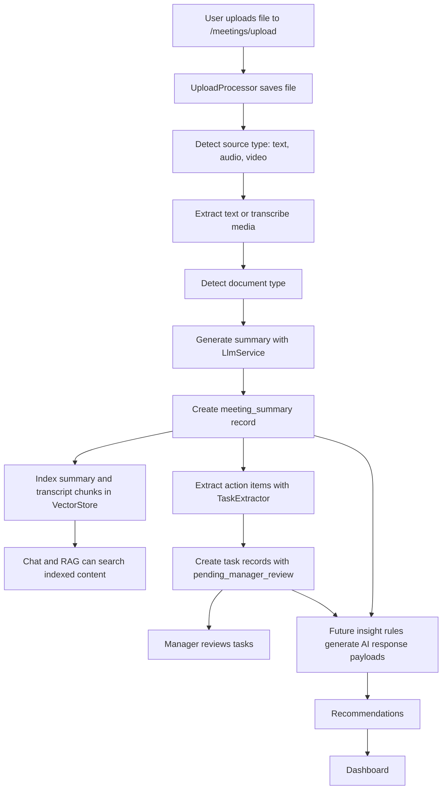
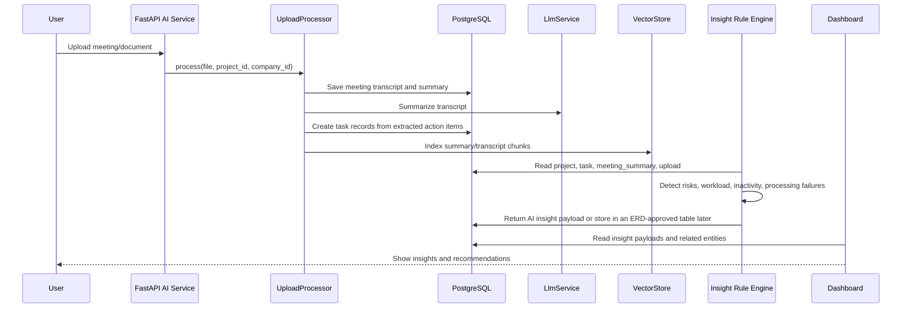

# AI Processing Workflow

## Objective

Document the full AI workflow from file upload to dashboard insights. This workflow follows the current FastAPI service structure, especially `UploadProcessor`, `MeetingRepository`, `TaskRepository`, `VectorStore`, `RagService`, and the existing database models.

## Current Workflow

## Target Workflow With Insights

## Stages

| Stage | Current implementation | Output |
| --- | --- | --- |
| Upload | `backend/app/api/v1/meetings.py` and `UploadProcessor` | Saved file and processed text. |
| Processing | `UploadProcessor._detect_source_type`, `_extract_text`, `_detect_document_type` | Source type and document type. |
| Transcript / text extraction | `Transcriber` for media, file readers for text/PDF/DOCX | Transcript text. |
| Summary | `LlmService.summarize` | `meeting_summary`. |
| Chunking | `VectorStore._meeting_documents` chunks transcript every 1600 characters | Vector-ready summary/transcript chunks. |
| Embedding / vector indexing | `VectorStore.index_meeting` | Pinecone records when configured. |
| Task extraction | `TaskExtractor.extract` | `task` with `pending_manager_review`. |
| Insights | Proposed rule engine | AI response payload, or an ERD-approved insight table later. |
| Recommendations | Proposed recommendation generator | Structured recommendation JSON. |
| Dashboard | Future UI/API consumer | Insight cards, risk panels, workload warnings. |

## Fields and Rules

- Meeting summaries should use `meeting_summary`.
- Extracted decisions should use `extracted_decision`.
- Uploaded files and knowledge documents should use `upload`.
- Knowledge chunks should use `knowledge_chunk`.
- New AI insight output should remain an API payload unless an ERD-approved insight table is added.

## Practical Example

1. A manager uploads a meeting recording.
2. The service transcribes it and stores the transcript in `meeting_summary`.
3. The AI summary is stored in `meeting_summary`.
4. Action items become `task` records with `pending_manager_review`.
5. The summary and transcript are indexed in Pinecone through `VectorStore`.
6. The insight rules detect that one extracted task is high priority and overdue.
7. The recommendation generator suggests assigning a backup owner.
8. The dashboard displays a high-severity insight linked to the task and meeting.
