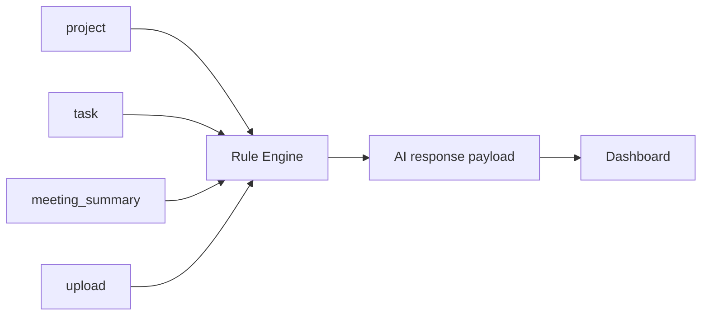

# Dashboard Insight Rules

## Objective

Define the rules used to generate dashboard insights from the existing Teamoria data model. These rules transform data from `project`, `task`, `meeting_summary`, and `upload` into actionable AI insight cards.

## Design



## Rules

| Rule name | Condition | Insight type | Severity | Suggested recommendation |
| --- | --- | --- | --- | --- |
| `overdue_task` | `task.due_date < today` and `task.status not in ('done')` | `risk` | `high` if overdue by 3+ days, otherwise `medium` | Ask the assignee for a status update, adjust the due date, or reassign support. |
| `inactive_project` | No project-related task, meeting summary, or upload update for 7+ days while `project.status = 'active'` | `activity` | `medium` at 7 days, `high` at 14+ days | Schedule a project review and confirm whether the project is still active. |
| `delayed_project_progress` | Project has active tasks but completion ratio is below expected progress based on deadline | `progress` | `medium` or `high` based on delay size | Reprioritize blockers and split large tasks into smaller owner-specific actions. |
| `missing_task_updates` | `task.status in ('open', 'in_progress', 'blocked')` and no recent meeting summary or task-linked evidence mentions the task | `activity` | `medium` | Request a written update from the owner before the next standup. |
| `high_workload_team_member` | A user has more than the configured threshold of open or in-progress tasks | `workload` | `medium` or `high` based on count and overdue tasks | Move lower-priority work to another member or defer it. |
| `failed_upload_or_ai_processing` | `upload.status in ('failed', 'processing_failed')` or upload processing raises an unsupported/empty-content error | `processing_error` | `high` | Re-upload a supported file, check parsing dependencies, or retry processing. |

## Rule Details

### Overdue Tasks

- Source: `task`.
- Uses: `due_date`, `status`, `priority`, `assigned_to_user_id`, `project_id`, `company_id`.
- Recommended severity:
  - `medium`: 1-2 days overdue.
  - `high`: 3-7 days overdue.
  - `critical`: more than 7 days overdue or priority is high and the task blocks other tasks.

### Inactive Projects

- Source: `project`, `task`, `meeting_summary`, `upload`.
- A project is considered inactive when there is no recent activity linked to `project_id`.
- Activity can include task creation, meeting creation, meeting upload, or knowledge document creation.

### Delayed Project Progress

- Source: `project`, `task`.
- Completion ratio:

```text
completed_tasks_count / total_tasks_count
```

- Expected progress can be estimated from elapsed project time:

```text
days_since_start / total_project_days
```

### Missing Task Updates

- Source: `task`, `meeting_summary`, and task-linked upload evidence.
- A missing update should be generated only for visible, active tasks.

### High Workload

- Source: `task`, `user`.
- Count active tasks where `assigned_to_user_id = user.id` and status is `open`, `in_progress`, `blocked`, or `pending_manager_review`.

### Failed Upload or AI Processing

- Source: `upload.status` and upload processing failures in `UploadProcessor`.
- Current upload flow creates `meeting_summary` records and indexes summaries through `VectorStore`; it does not yet persist all upload failures.

## Example Insight

```json
{
  "title": "Project has had no updates for 10 days",
  "type": "activity",
  "severity": "medium",
  "description": "The project is active, but no linked tasks, meeting summaries, or uploads were updated recently.",
  "recommendation": "Schedule a short project review and confirm current blockers with the project manager.",
  "confidence_score": 0.84,
  "metadata": {
    "rule": "inactive_project",
    "inactive_days": 10,
    "project_id": 88
  }
}
```
